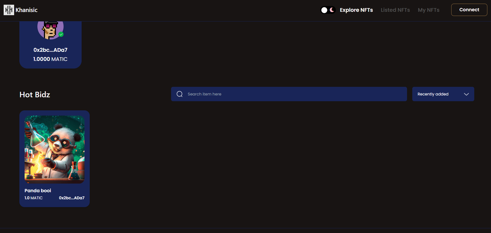
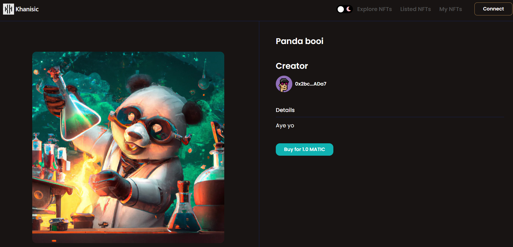
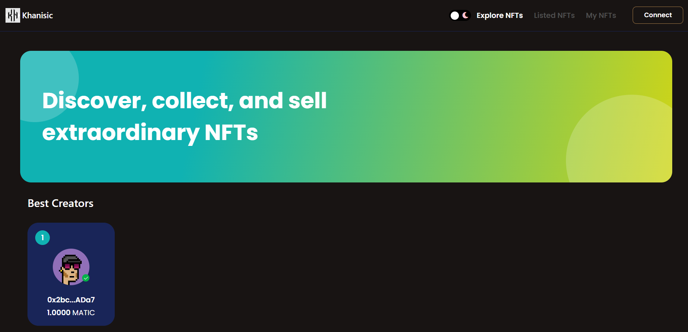

# NFT Marketplace

<p>Hey guys, Khanisic/Abdul Moid Khan here 👋.</p>
<br/>
<p>Welcome to the NFT Marketplace where you can upload your images and watch them turn into NFTs. Here, you can trade your NFTs with other creators.</p>
<br/>
<p>I have used <i>Next.js - A fullstack react framework,</i> to build the project deployed it on vercel. For the smart contract deployment, I've used hardhat and used MATIC to power the smart contract!</p>
<p>Screenshots:</p>



Steps to install:

1.Run the npm install command.

```shell
npm install
```

2.After the dependencies have been installed, run the build command.

```shell
npm run dev
```

<p>Further explanation can be found here on my Medium blog - <a link="https://betterprogramming.pub/creating-an-nft-marketplace-solidity-2323abca6346">Creating an NFT Marketplace with solidity</a> </p>

<p>Thank You ❤️</p>
